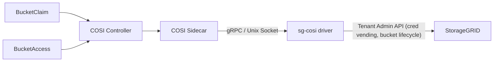

# `sg-cosi` driver - COSI `v1alpha1`-compatible driver for NetApp StorageGRID 12.0

## What it is and what it does

`sg-cosi` is an opinionated COSI driver with a deliberately limited scope. It supports only two kinds of StorageGRID buckets:

- "Static": use *existing* regular bucket. 
- "Dynamic": create/delete *read-only, snapshot* buckets (not *read-write* snapshot buckets) - see the screenshots and a demo [here](https://scaleoutsean.github.io/2026/06/13/storagegrid-sg-cosi-branch-snapshots.html)

| Features | `sg-cosi` | Comment
| :---     | ----        | :--- | 
| Auto Bucket Access Granting | yes | Creates ephemeral tenant account and S3 key-set. Stores keys in Kubernetes namespace. |
| Auto Bucket Access Revoking | yes | Deletes credentials in Kubernetes, removes ephemeral COSI tenant account(s) on StorageGRID. |
| Dynamic Bucket Lifecycle | limited| This is supported with read-only snapshot buckets only. |
| Static Bucket Lifecycle | limited | This helps claim existing buckets in Kubernetes. Supported Reclaim Policy Retain. |

Complete and unrestricted bucket lifecycle doesn't require additional development, but it's not supported because [COSI v1alpha1 is garbage](https://scaleoutsean.github.io/2026/06/07/cosi-v1alpha1-is-garbage.html) and `sg-cosi` implements what's in author's opinion reasonably safe and useful for StorageGRID, rather than what is possible in COSI.

Because dynamic bucket lifecycle for new regular buckets is not enabled, Tenant Admin (or equivalent) is required to create regular buckets *before* COSI can use them. After they're removed from COSI, they continue to be managed by Tenant Admin(s).

| Who | Where | What |
| --- | ----- | ---- |
| Tenant Admin | StorageGRID | Create/Delete new regular Bucket |
| `sg-cosi` driver | Kubernetes(, StorageGRID) | Register/Release existing regular Bucket in Kubernetes, or Create/Delete read-only snapshot bucket |
| `sg-cosi` driver | StorageGRID, Kubernetes  | Create/Delete ephemeral tenant accounts and their S3 keys, store a copy of S3 keys in COSI namespace |
| Bucket users | S3 API      | Empty regular bucket to get it ready for deletion by Tenant Admin, otherwise Tenant Admin must delete objects and bucket | 
| Tenant Admin | StorageGRID | Delete empty regular bucket; delete objects first if bucket not already empty |

Notice that, because `sg-cosi` supports only *read-only* snapshot buckets, deleting snapshot buckets requires no user or Tenant Admin action. You just drop claims on a COSI instance's bucket resource and read-only snapshot bucket will be deleted. 

COSI drivers can talk to StorageGRID over two endpoints. `sg-cosi` currently supports only existing buckets and therefore does not use the second method:

| Endpoint | Required | Note |
| ---------| :---:    | :----|
| SG Tenant Mgmt (TCP/9443) | **Y** | Control Flow ; required for access management |
| S3 API (TCP/10443) | N | Data Flow; `sg-cosi` doesn't support regular bucket create/delete, so it doesn't use this endpoint |

The S3 **users** in the Kubernetes namespace served by `sg-cosi` driver still need access to S3 API endpoints.

## Compatibility

| Component | Versions |
|-----------|----------|
| StorageGRID | 12.0 |
| Helm | >= 3 |
| Kubernetes | >= 1.35 |
| COSI Controller | v0.2.2 (`v1alpha1` specification)|

While it may be tempting to just use `:latest`, this isn't one of those cases. COSI Controller is unstable and buggy as it is, and each release is broken in different ways. Even the StorageGRID side of `sg-cosi` is sensitive to minor StorageGRID version changes because the bucket snapshot feature is very new.

## Quick Start

- **Tenant Management API:** the COSI driver needs network access to a Tenant Management endpoint. Make sure this endpoint is reachable from COSI driver pod.
- **Tenant S3 API:** the S3 clients from the COSI-enabled namespace require access to the S3 API endpoint. Because `sg-cosi` deliberately does not support buckets creation and deletion over S3 API, it does not need to connect over S3 API endpoint. But COSI users (clients) need access to this API endpoint.

### 1. Install the COSI Controller

If you try another version, including `:latest` (if it's not equivalent to v0.2.2), `sg-cosi` is very likely to fail or malfunction.

```bash
kubectl create -k 'https://github.com/kubernetes-sigs/container-object-storage-interface//?ref=v0.2.2'
```

### 2. Install the `sg-cosi` Driver

**Note on Multi-Tenancy:** A single instance of this COSI driver maps exactly to **one StorageGRID Tenant**. If you have multiple StorageGRID tenants (e.g., Coke and Pepsi), you must perform this installation process multiple times (once for each StorageGRID tenant who wishes to use COSI) using different Kubernetes namespaces (e.g., `sg-cosi-coke`, `sg-cosi-pepsi`) and unique COSI driver names (e.g., `coke.sg.cosi.dev`) because each instance of `sg-cosi` must not see the credentials that belong to a different StorageGRID tenant.

First, create a Kubernetes Namespace and a Secret containing your StorageGRID Tenant credentials (a local Tenant Root/Admin account is required for generating S3 keys):

```bash
# Create the isolated driver namespace for this specific tenant
kubectl create namespace sg-cosi-coke

# Create the Tenant credentials secret securely via kubectl
# Note: If your StorageGRID username contains spaces (e.g. "Cosi Admin"), wrap it in quotes!
kubectl create secret generic sg-tenant-credentials \
  --from-literal=username="YOUR_TENANT_USERNAME" \
  --from-literal=password="YOUR_TENANT_PASSWORD" \
  -n sg-cosi-coke # always store credentials in the Tenant's namespace

#  ^^^^^ if you have tenants "coke", "pepsi":
# - name credentials differently: sg-coke-tenant-credentials, sg-pepsi-tenant-credentials
# - create each in its own namespace; don't put Pepsi tenant admin's secret inside of the sg-cosi-coke namespace!!!

```

Next, copy `./deploy/helm/sg-cosi-driver/values.yaml` to `my-values.yaml` to specify your StorageGRID connection endpoints and Tenant ID:

```yaml
driver:
  name: "coke.sg.cosi.dev" # Must be unique globally in the K8s cluster
storagegrid:
  s3Endpoint: "https://coke.s3.example.com:10443"
  adminEndpoint: "https://coke-tenant-admin.s3.example.com:9443"
  region: "us-east-1"
  s3AddressingStyle: "path"
  tls:
    insecureSkipVerify: true  # You'll need this if you use HTTPS and your TLS cert is fake
    caCertMapName: ""         # Optional ConfigMap containing 'ca.crt' to mount for StorageGRID validation
  tenant:
    accountId: "26296085394235545212"               # This is the Tenant's ID, not Tenant root Account's ID! Example: 26296085394235545212
    groupId: "121701ec-c832-4cc8-97b7-35562c40db9c" # Tenant Group ID *in* Coke tenant. Example: a5e9cbcb-181b-4506-9551-fb1a7c52c820
    credentials:
      secretName: "sg-tenant-credentials"  # Secret name matches the secret created above
bucketClass:
  name: "sg-cosi-coke-default" # Must be unique across the cluster if mapping multiple tenants
bucketAccessClass:
  name: "sg-cosi-coke-readonly" # Must be unique across the cluster if mapping multiple tenants
```

This is the key step as far as making mistakes is concerned, so be careful.

`values.yaml` have some other useful settings including default S3 key validity, tenant group options for assigning ephemeral COSI users to different tenant groups, etc.

Finally, install the driver to your target namespace using Helm. Change name, values file, and namespace when installing for other tenants.

```bash
helm upgrade --install sg-cosi-coke \
  ./deploy/helm/sg-cosi-driver/ \
  -f my-values.yaml  \
  --namespace sg-cosi-coke
```

If all went well, you should see driver name and namespace that should be used in related manifests when using this *instance* of COSI. You may want to save the output of Helm installation to a file if you will have a more than a handful of COSI-enabled namespaces.

```raw
NAME: sg-cosi-coke
LAST DEPLOYED: Thu Jun 18 17:53:38 2026
NAMESPACE: sg-cosi-coke
STATUS: deployed
REVISION: 1
DESCRIPTION: Install complete
```

If Pepsi also wants to use COSI, deploy another instance (sg-cosi-pepsi-frontend) to another namespace (e.g. sg-cosi-pepsi-frontend).

Also note other details in Helm output, for example, bucket class name. It's best to save these somewhere for copy-paste, because you'll likely make typos and mix things up. 

```raw
Deployment: sg-cosi-coke-sg-cosi-driver (namespace: sg-cosi-coke)
ServiceAccount: sg-cosi-coke-sg-cosi-driver
ClusterRole: sg-cosi-coke-sg-cosi-driver
ClusterRoleBinding: sg-cosi-coke-sg-cosi-driver
BucketClass: sg-cosi-coke-default
BucketAccessClass: sg-cosi-coke-readonly
```

### 3. Claim an Existing Bucket (Brownfield)

Because Kubernetes COSI `v1alpha1` employs a strictly decoupled architectural model, mapping a pre-existing StorageGRID bucket to a namespace requires two distinct steps:
1. The **Cluster Administrator** creates a global `Bucket` resource mapping strictly to the backend `existingBucketID` and patches it as Ready.
2. The **Developer** creates a `BucketClaim` that targets the newly created global `Bucket` via `existingBucketName`.

> **Note:** Directly creating a `BucketClaim` without `existingBucketName` will incorrectly trigger COSI's *Greenfield* (dynamic provisioning) logic, resulting in randomly generated Bucket UUIDs on COSI side.

Instead of embedding incomplete snippets here, there's a fully documented, canonical, end-to-end blueprint for mapping existing buckets that's based on the installation steps above to minimize mistakes. You still need your Tenant ID and group IDs used to host ephemeral accounts (used for credentials vending).

Please follow the instructions in:
[`./examples/brownfield-existing-bucket.sh`](./examples/brownfield-existing-bucket.sh)

### Multi-Tenant Group Overrides & Credential Expiration

K8s COSI provisions Service Accounts mapped dynamically into the Tenant Group specified globally via `TENANT_GROUP_ID`.

To enable Multi-Group routing (e.g. creating isolation bounds for distinct `readOnly` vs `readWrite` S3 Policies you construct manually on StorageGRID endpoints), you can optionally **override** the global fallback logic on individual BucketAccessClasses directly within an opaque `parameters` payload.

Additionally, to mitigate the risk of orchestrated K8s cluster teardowns failing to invoke COSI cleanup routines (leaving orphaned credentials with "no expiration" on the StorageGRID tenant), administrators can inject an optional `validDays` integer parameter to defensively apply a hard TTL limit for any S3 key spawned by that Class:

```yaml
apiVersion: objectstorage.k8s.io/v1alpha1
kind: BucketAccessClass
metadata:
  name: sg-readonly
driverName: sg.cosi.dev
authenticationType: Key
parameters:
  tenantGroupId: "a5e9cbcb-has-from-tenant-group-with-read-only-bucket-acls"
  validDays: "30"
```

### 4. Get Credentials

This example just shows how this YAML looks like. See `./examples` for supported workflows with consistent variables.

```yaml
apiVersion: objectstorage.k8s.io/v1alpha1
kind: BucketAccess
metadata:
  name: my-bucket-access
  namespace: sg-cosi-coke
spec:
  bucketClaimName: my-bucket
  bucketAccessClassName: sg-cosi-coke-default
  credentialsSecretName: my-bucket-credentials
  protocol: s3
```

This creates a user on StorageGRID, attaches a bucket policy, and writes the credentials to a Secret:

```bash
$ kubectl get secret coke-s3-analytics-bucket-credentials -n sg-cosi-coke -o jsonpath='{.data.BucketInfo}' | base64 -d | jq
{
  "metadata": {
    "name": "bc-02d05065-5650-430e-a298-45474922448c",
    "creationTimestamp": null
  },
  "spec": {
    "bucketName": "sg-brownfield-coke-analytics-bucket",
    "authenticationType": "Key",
    "secretS3": {
      "endpoint": "https://192.168.1.211:10443",
      "region": "us-east-1",
      "accessKeyID": "MP6B...",
      "accessSecretKey": "WrUT..."
    },
    "secretAzure": null,
    "protocols": [
      "s3"
    ]
  }
}
```

Your app can mount this Secret and talk to StorageGRID directly. `ba-` stands for bucket access.

### 5. Uninstall

There may be many COSI instances. Uninstall from the correct namespace (reference the output of Helm install command).

```sh
helm uninstall sg-cosi-coke -n <NAMESPACE>
```

## Configuration

### Helm Values

Key parameters are listed below. See [`values.yaml`](deploy/helm/sg-cosi-driver/values.yaml) for the full list, including `securityContext`, `serviceAccount`, `nodeSelector`, `tolerations`, and `affinity`.

| Parameter | Description | Default |
|-----------|-------------|---------|
| `driver.name` | COSI driver name (required) | `""` |
| `storagegrid.s3Endpoint` | StorageGRID S3 API endpoint | derived from `serviceName` |
| `storagegrid.adminEndpoint` | StorageGRID Admin API endpoint | derived from `serviceName` |
| `storagegrid.region` | S3 region | `us-east-1` |
| `storagegrid.credentials.secretName` | Admin credentials Secret name | `storagegrid-root-credentials` |
| `driver.image.repository` | Driver container image | `docker.io/scaleoutsean/sg-cosi-driver` |
| `driver.image.tag` | Image tag (defaults to chart appVersion) | `""` |
| `sidecar.extraArgs` | Extra arguments for COSI sidecar (e.g. `["--v=5"]`) | `[]` |
| `bucketClass.create` | Create a default BucketClass | `true` |
| `bucketAccessClass.create` | Create a default BucketAccessClass | `true` |

### Environment Variables

| Variable | Description |
|----------|-------------|
| `DRIVER_NAME` | COSI driver name (required) |
| `STORAGEGRID_S3_ENDPOINT` | StorageGRID S3 API endpoint URL (required) |
| `STORAGEGRID_ADMIN_ENDPOINT` | StorageGRID Tenant API endpoint URL (required) |
| `TENANT_ACCOUNT_ID` | StorageGRID tenant account ID (required) |
| `TENANT_USERNAME` | StorageGRID tenant local/root username (required) |
| `TENANT_PASSWORD` | StorageGRID tenant password (required) |
| `TENANT_GROUP_ID` | StorageGRID group ID for COSI workload assignments (required) |
| `STORAGEGRID_REGION` | S3 region (default: `us-east-1`) |
| `COSI_CERTIFICATE_AUTHORITY` | Path to CA certificate for StorageGRID TLS validation |
| `STORAGEGRID_INSECURE_SKIP_VERIFY` | Skip TLS verification for StorageGRID API (default: `false`) |
| `AWS_S3_ADDRESSING_STYLE` | S3 addressing style pushed to K8s secrets (default: `path`) |

### Brownfield Deletion Policy (`deletionPolicy: Retain`)

Because StorageGRID employs a distributed Cassandra metadata architecture, issuing commands to forcefully delete buckets containing millions of test objects can result in long-running API transactions that bottleneck API throughput and eventually timeout in Kubernetes control paths.

To eliminate this operational friction, this driver defaults all globally provisioned `BucketClass` CRDs to `deletionPolicy: Retain`. 
When a Kubernetes developer finishes local testing and deletes their namespace and `BucketClaim`, the driver simply ignores the backend StorageGRID resources. K8s users are immediately unblocked, while the StorageGRID Tenant Administrator can leverage asynchronous cleanup tools (like ArgoCD teardown jobs or native SG ILM expiration routines) to slowly drain and delete orphaned development buckets at their preferred time and pace. 

### Provisioning Static Brownfield Buckets (v1alpha1)

When an administrator manually provisions a static `Bucket` resource mapping to an external, pre-existing StorageGRID bucket, Kubernetes COSI requires an extra validation sign-off before allowing applications to mint access keys.

Because `kubectl apply` does not mutate a resource's `status` subresource directly, the cluster administrator **must manually patch** the COSI Bucket object to declare it as dynamically validated. 

After applying your `coke-brownfield-bucket.yaml` manifest, you must execute:
```bash
kubectl patch bucket <YOUR_BUCKET_NAME> --subresource status --type merge -p '{"status": {"bucketID": "<STORAGEGRID_BUCKET_NAME>", "bucketReady": true}}'
```

Only after this successful patch will `BucketAccess` requests successfully trigger the driver to generate StorageGRID S3 credentials.

## Architecture (`v1alpha1`)



Each instance of the driver runs as a Deployment with two containers: the driver itself (implements the COSI gRPC `Provisioner` and `Identity` services) and the standard [objectstorage-sidecar](https://github.com/kubernetes-sigs/container-object-storage-interface) that bridges Kubernetes CRs to gRPC calls. They communicate over a shared Unix socket.

When you create a `BucketClaim`, the COSI controller dispatches to the sidecar, which calls `DriverCreateBucket` on the driver. The driver validates the name and dynamically creates Snapshot buckets via the native StorageGRID Tenant Management API.

When you create a `BucketAccess`, the same path calls `DriverGrantBucketAccess`. The driver creates a tenant user in the specified user group, issues S3 access credentials via the Tenant API, and securely pushes them back into the Kubernetes Secret requested by the user.

> **Note on Network Architecture:** Unlike CSI, which elegantly separates the Control Plane (CSI Controller Pod) from Data Path endpoints (CSI Node Daemonset), COSI `v1alpha1` architecture forces all logic through a centralized Provisioner. 
> For enterprise security segmentation: Your K8s Driver Pod needs network access *only* to the StorageGRID **Tenant Management API** (default StorageGRID ports 9443 (Tenant) and 443 (Grid and Tenant)). `sg-cosi` driver **does not** require network access to the S3 Endpoints. S3 access is strictly limited to the Application Pods consuming the resulting credentials and accessing the bucket.

## Tenant admin's credentials

Note: The StorageGRID Tenant credentials supplied to K8s must belong to a local Tenant user. Federated/SAML accounts are not supported due to the headless nature of Kubernetes operators.

**CRITICAL:** The Tenant user's group MUST have the **`Root access`** (`rootAccess: true`) permission checked in the StorageGRID Access Management UI. StorageGRID does not have a granular "Manage All S3 Credentials" capability; therefore, without `Root access`, the driver will receive a `403 Forbidden` error when attempting to mint S3 keys for dynamically generated COSI users.

This COSI driver uses Tenant Admin (or equivalent, for the purpose of Bucket and S3 key operations). If you rotate its credentials, make sure to update COSI driver's secret.

If current Bearer Token gets deleted before it naturally expires - restart the COSI driver to get a new one. Without that, it may remain effectively offline until end of its refresh cycle (12 hours).

## Security considerations

How you manage tenants is up to you, but having dedicated COSI-only tenants seems like the only reasonable approach to me. If I had Coke and Pepsi as tenants who needed COSI, I'd create new tenants (cosi-coke, cosi-pepsi) for COSI use.

- In StorageGRID bucket ACLs, it is recommended to restrict access by IP address:
```json
"Condition": {
  "IpAddress": {
    "aws:SourceIp": "192.168.1.220/29"
  },
}
```
- On Kubernetes, you may use reverse proxies (NGINX+) or CNI to ensure S3 is accessed from only allowed IP address or range
- Make this (ACL policy and Kubernetes-side configuration) part of your COSI workflow for each new bucket or namespace.

## Troubleshooting

**COSI Sidecar Event Loop Deadlock ("can't create an event"):**
If you install the driver to an isolated namespace (e.g. `sg-cosi-coke`) and notice claims getting stuck indefinitely during creation or deletion, while the driver logs show `event.go:368] "Unable to write event... can't create an event with namespace 'default' in namespace 'sg-cosi-coke'"`, you have encountered a bug in the upstream `objectstorage-sidecar v0.2.2`. 
* **The Bug:** Kubernetes defaults cluster-scoped object (like `Bucket`) events to the `default` namespace, but the v0.2.2 sidecar hardcodes its event-writer client to match the deployment namespace (`sg-cosi-coke`), causing an unrecoverable cross-namespace RBAC crash. 
* **The Workaround:** Deploy the driver Helm chart directly into the `default` namespace. When the driver deployment lives in `default`, the event namespaces align perfectly and all deadlocks vanish.

**BucketClaim stays pending:**
Check that the COSI controller is running (`kubectl get pods -n <NAMESPACE> | grep cosi`), check driver logs (`kubectl logs deploy/<DEPLOYMENT_NAME> -c driver -n <NAMESPACE>`), and make sure at least the StorageGRID Admin API (`tenantEndpoint`) is reachable from the cluster.

**Access denied after granting:**
Make sure the admin credentials Secret exists with valid keys, and that the admin account has permission to create users and set bucket policies.

**What's COSI sidecar doing?**
`kubectl logs deploy/<DEPLOYMENT_NAME> -c sidecar -n <NAMESPACE> --tail=30`

**What COSI resources are there**
```sh
kubectl get bucketclaims,buckets,bucketaccesses -n <NAMESPACE>
```

**Force-finalize a stuck bucket claim:**
```sh
kubectl patch bucketclaim my-snapshot-claim -n <NAMESPACE> -p '{"metadata":{"finalizers":[]}}' --type=merge
```

## Contributing

Issues related to functioning of the driver and pull requests for documentation and manifests are accepted.

At this time - due to the fact that `sg-cosi` is closed source - code contributions are not accepted. See [FAQs](FAQs.md) for more on this.

## Resources

- [NetApp StorageGRID](https://docs.netapp.com/us-en/storagegrid/) - NetApp's object storage platform
- [COSI Specification](https://github.com/kubernetes-sigs/container-object-storage-interface-spec) - Container Object Storage Interface spec
- [COSI Controller](https://github.com/kubernetes-sigs/container-object-storage-interface) - Reference COSI controller

## Privacy

`sg-cosi` driver does not collect telemetry or any other data and nothing is sent anywhere. It can connect only to the Tenant API management endpoints you configure.

## License and Copyright

- Any deployment manifests, charts, scripts, code: see the [LICENSE](LICENSE) for copyright information
- `sg-cosi` documentation: [CC BY 4.0](https://creativecommons.org/licenses/by/4.0/deed.en)
